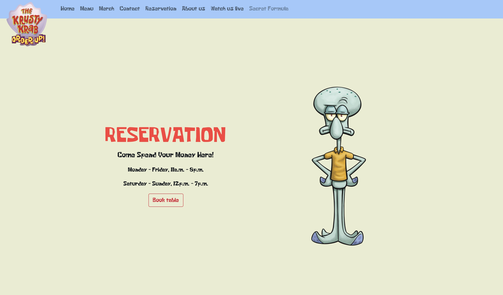

## Krusty Krab Website

Are you ready, kids? Home of the legendary Krabby Patty, Bikini Bottom’s most famous (and only) fast-food joint. Family-friendly, fry-cook
powered, and managed with just enough pinch of Mr. Krabs’ greed. Dine in, take out, or just loiter while Squidward
glares at you.

## About

A 2-day micro challenge to design and build a website for a fictional business using only HTML and CSS. Developed by a
team of three, the project recreated the world of SpongeBob with a Krusty Krab–themed design, playful visuals, and
on-brand styling. An homage to the animated series that cleverly used Bootstrap to bring Bikini Bottom online in record
time.

## Disclaimer

All contributor information except for the author's own contributions in this repository has been anonymized. Any names,
emails, or identifying details have been removed or replaced to protect privacy.

The images used on this site are intended solely for parody and comedic purposes. They are not affiliated with, endorsed by, or meant to infringe upon any existing copyrights or trademarks.